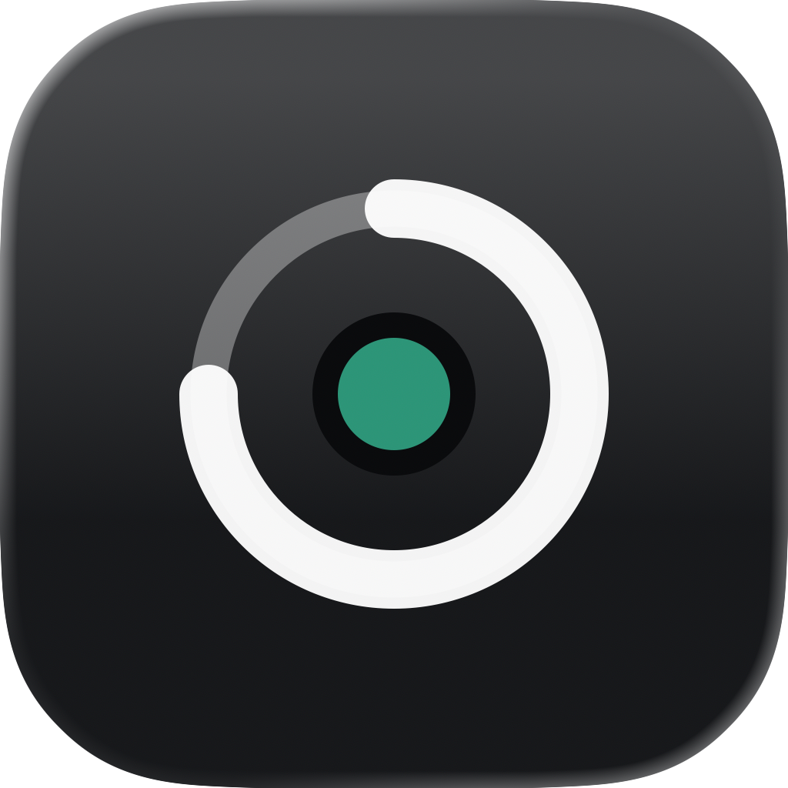
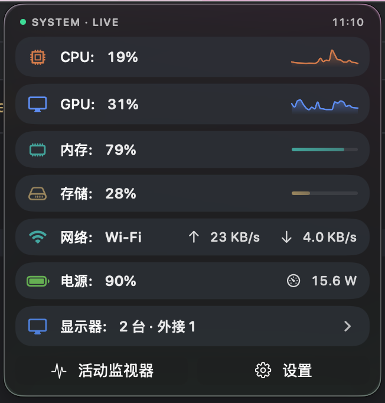
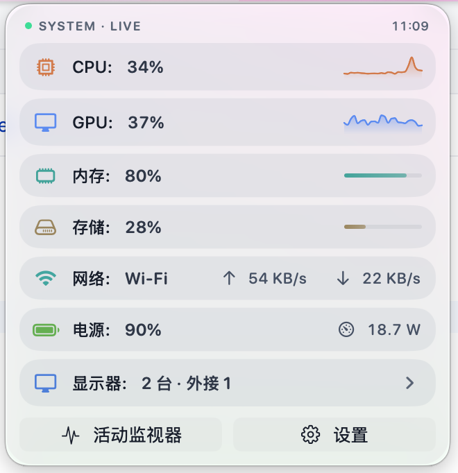
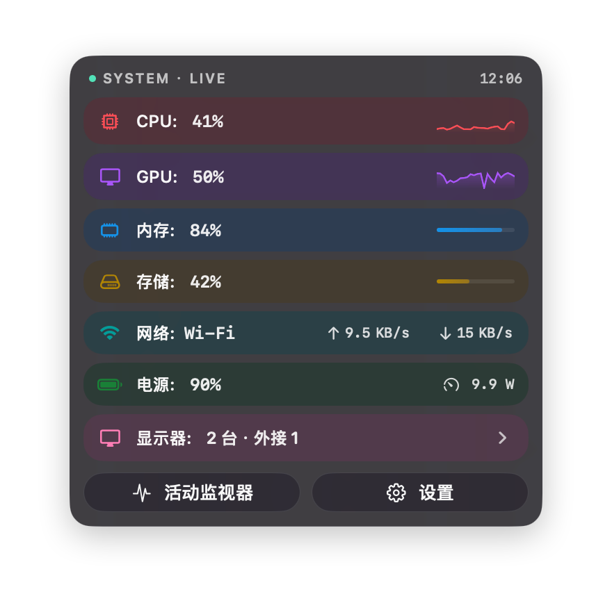
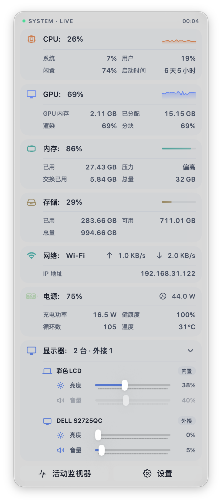

# HagimiMonitor

> [English](README.en.md) · [官网](https://acerola-1.github.io/hagimi-monitor/)

<p align="center">
  
</p>

<p align="center">
  <strong>你的 Mac，一眼即懂。</strong>
</p>

<p align="center">
  HagimiMonitor 是一款优雅的 macOS 菜单栏系统监控工具，将 CPU、GPU、内存、存储、网络、电池与显示器状态，以动态圆环和紧凑玻璃面板呈现在菜单栏。
</p>

<p align="center">
  <a href="https://github.com/Acerola-1/hagimi-monitor/releases/latest"><strong>下载最新版</strong></a> ·
  <a href="https://apps.apple.com/app/hagimimonitor/id6792169908"><strong>App Store</strong></a> ·
  <a href="#版本选择">版本选择</a> ·
  <a href="#功能亮点">功能亮点</a> ·
  <a href="#截图">截图</a> ·
  <a href="#安装">安装</a> ·
  <a href="#构建">构建</a>
</p>

<p align="center">
  <a href="https://github.com/Acerola-1/hagimi-monitor/releases/latest">
    
  </a>
  &nbsp;
  <a href="https://apps.apple.com/app/hagimimonitor/id6792169908">
    
  </a>
</p>

<p align="center">
  
  
  
  
  
  <a href="https://x.com/Acerola64175279"></a>
</p>

## 截图

### 多主题配色

HagimiMonitor 内置语义化 Palette，模块色、玻璃背景、分隔线、进度轨道和状态色会随主题统一变化。目前提供「平衡」与「活力」两套风格，并完整适配浅色 / 深色模式。

| 平衡 · 深色 | 平衡 · 浅色 |
| --- | --- |
|  |  |

| 活力 · 深色 | 活力 · 浅色 |
| --- | --- |
|  |  |

### 展开即见详情

默认状态保持紧凑，点击菜单栏后即可展开查看 CPU、GPU、内存、存储、网络、电池和显示器等模块的完整信息。

<p align="center">
  
</p>

## 功能亮点

### 菜单栏一眼可见

动态环形图标实时反映系统负载，综合 CPU 与 GPU 使用率平滑计算当前压力。轻载、忙碌、接近高压，都能直接从菜单栏判断。

### 七大监控模块

从菜单栏到详细面板，每一个关键指标都触手可及：

- **CPU**：系统 / 用户 / 空闲占用、运行时间、温度读取、进程级占用
- **GPU**：图形负载、渲染 / 分块性能、显存信息
- **内存**：使用率、内存压力、交换分区、压力等级变化
- **存储**：系统磁盘、外部卷容量、读写速率
- **网络**：上传 / 下载速率、网络接口类型、IP 信息
- **电池与电源**：电量、供电状态、功耗、健康度等可用信息
- **显示器**：亮度、音量、对比度控制，取决于设备 DDC/CI 支持情况

### 玻璃拟态与统一配色

面板采用轻量玻璃拟态 UI，并通过统一 Palette 管理模块强调色、状态语义色、分隔线、进度轨道和浅深色模式，让信息层级更清晰。

### 统计、健康评分与事件检测

HagimiMonitor 会围绕系统状态提供更多长期视角：

- 0-100 分 Mac 健康评分，覆盖 CPU、GPU、磁盘、内存压力与散热维度
- 24 小时、7 天、30 天、一年等多时间维度统计
- 自动检测 CPU 高负载、内存压力、磁盘空间不足、网络流量峰值等关键事件

### 外接显示器控制

支持通过 DDC/CI 协议在菜单栏内调节外接显示器亮度、音量和对比度。该功能依赖显示器、线材、连接方式和系统环境支持；不支持的控制项不会强行展示为可用。

### Swift 原生，轻量常驻

应用使用 Swift / SwiftUI 原生开发，面向 Apple Silicon 优化。日常常驻内存约 50 MB，适合作为长期挂在菜单栏里的系统状态面板。

## 版本选择

HagimiMonitor 提供两种获取方式，核心监控体验一致；受 App Store 沙箱限制，部分功能仅 GitHub 直连版提供：

| 功能 | GitHub 版（免费） | App Store 版（打赏支持） |
| --- | :---: | :---: |
| 七大监控模块（CPU / GPU / 内存 / 存储 / 网络 / 电池 / 显示器信息） | ✅ | ✅ |
| 历史统计 · 健康评分 · 事件检测 | ✅ | ✅ |
| 双主题 · 玻璃拟态界面 | ✅ | ✅ |
| 外接显示器控制（DDC/CI 亮度 / 音量 / 对比度） | ✅ | ❌ 沙箱限制 |
| 媒体键接管 | ✅ | ❌ 沙箱限制 |
| TOP 进程监控（CPU / 内存 / 存储 / 网络 TOP 进程） | ✅ | ❌ 沙箱限制 |
| 温度传感器读取（CPU 温度） | ✅ | ❌ 沙箱限制 |
| 更新方式 | 内置自动更新 | App Store 更新 |
| 价格 | 免费 | 付费 · 支持开发者 |

> 由于 App Store 沙盒限制，部分功能无法在沙盒环境中正常工作，因此 App Store 版功能不完整。

> 💚 **App Store 版，是一份心意**：两个版本的核心监控体验一致。如果 HagimiMonitor 帮到了你，而你又不需要显示器控制、TOP 进程监控、温度读取这些沙箱外功能，欢迎在 [App Store](https://apps.apple.com/app/hagimimonitor/id6792169908) 购买。它更像一杯咖啡，是对独立开发者持续维护的一份支持与鼓励。无论你选择哪个版本，都同样感谢。

## 安装

1. 从 [Releases](https://github.com/Acerola-1/hagimi-monitor/releases/latest) 下载最新版 `.dmg`
2. 打开 DMG，将 HagimiMonitor 拖入 Applications 文件夹
3. 从 Launchpad 或 Applications 启动

应用已通过 Apple 公证，下载后可直接打开。

## 系统要求

- macOS 15 及以上
- Apple Silicon（M 系列芯片）

## 构建

开发调试建议使用 `HagimiMonitorDirect` scheme：

```bash
xcodebuild -project hagimi-monitor.xcodeproj -scheme HagimiMonitorDirect -configuration Debug build
```

Release / App Store 构建：

```bash
xcodebuild -project hagimi-monitor.xcodeproj -scheme HagimiMonitor -configuration Release build
```

运行测试：

```bash
xcodebuild -project hagimi-monitor.xcodeproj -scheme HagimiMonitorDirect -configuration Debug test
```

## Star History

<p align="center">
  <a href="https://star-history.com/#Acerola-1/hagimi-monitor&Date">
    <picture>
      <source media="(prefers-color-scheme: dark)" srcset="https://api.star-history.com/svg?repos=Acerola-1/hagimi-monitor&type=Date&theme=dark" />
      <source media="(prefers-color-scheme: light)" srcset="https://api.star-history.com/svg?repos=Acerola-1/hagimi-monitor&type=Date" />
      
    </picture>
  </a>
</p>

<p align="center">
  如果这个项目对你有帮助，欢迎点一个 ⭐ 支持持续维护。
</p>

## 许可证

本项目采用 **GNU AGPL-3.0** 双许可模式：

- **开源使用**：源码公开，任何人可在 [AGPL-3.0](LICENSE) 条款下自由查看、修改、分发。
  按 AGPL 要求，任何基于本项目的衍生作品（含通过网络提供服务的情形）也必须以
  AGPL-3.0 开源其完整源码。
- **商业使用**：如果你希望在**不遵守 AGPL 开源义务**的前提下将本项目用于商业产品
  （例如闭源分发、上架收费而不公开源码），**必须获取商业授权**。
  请通过 [GitHub](https://github.com/Acerola-1/hagimi-monitor) 提 Issue 或私信作者洽谈。

版权所有 © 2026 Acerola。保留所有权利。

### 第三方组件

本项目使用的第三方库各自遵循其原始协议，不受本项目 AGPL/商业许可约束：

- **Sparkle**（自更新框架）— MIT 类许可
